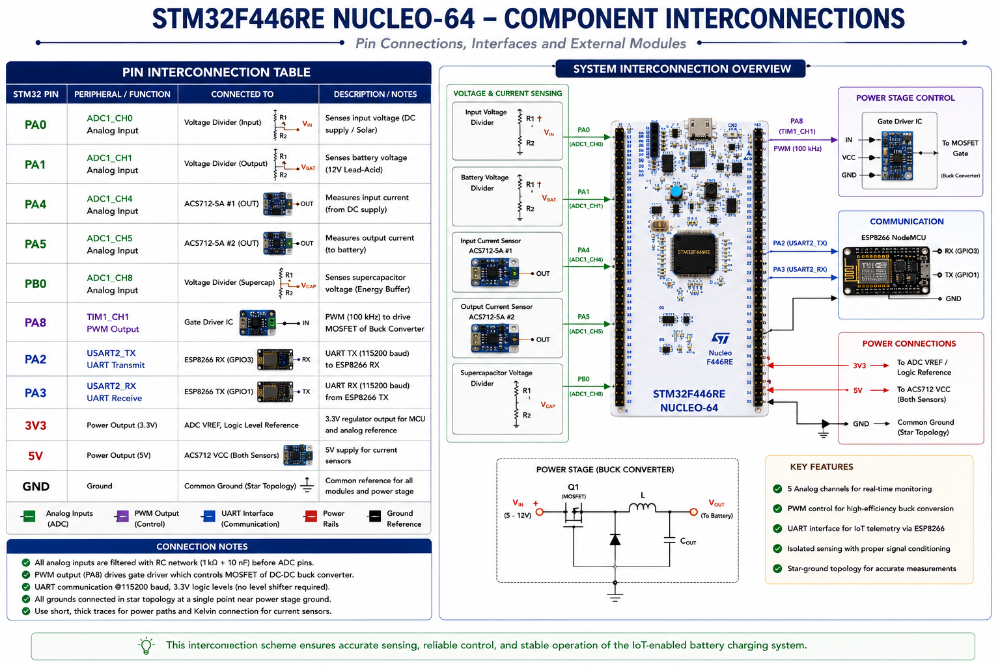
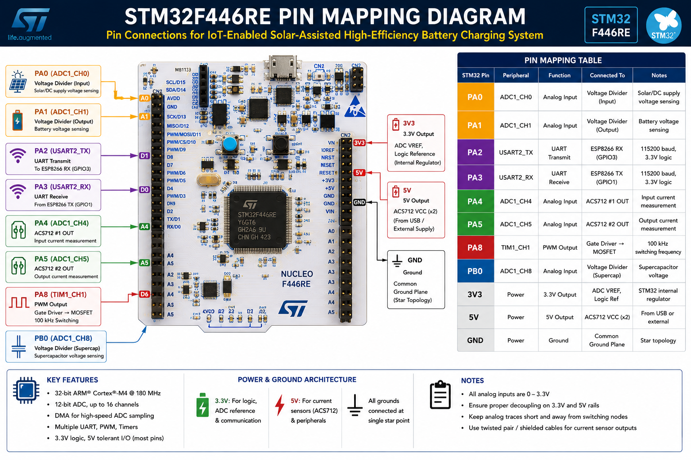
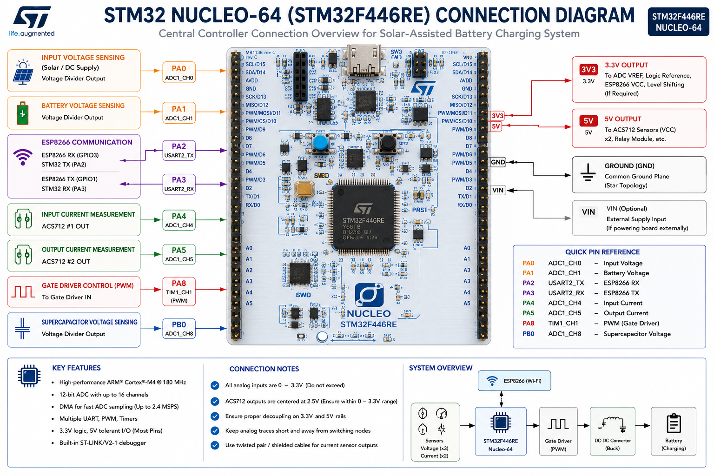
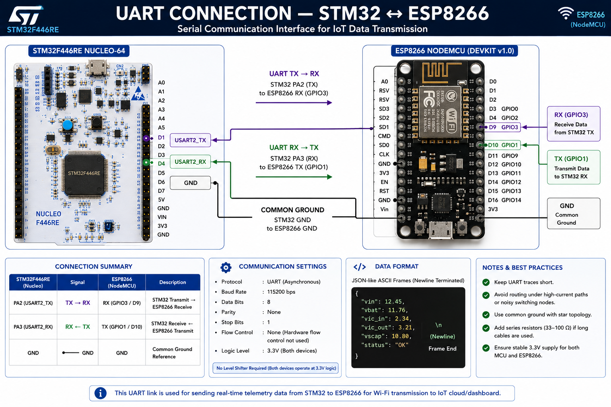
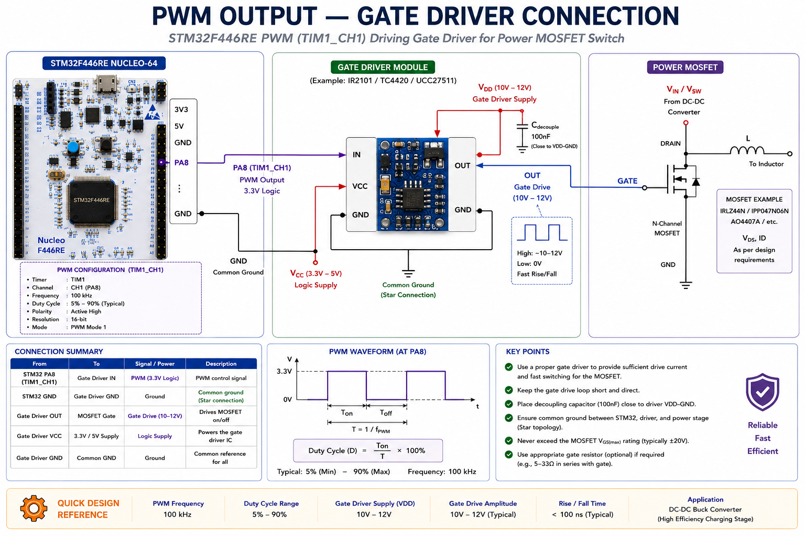
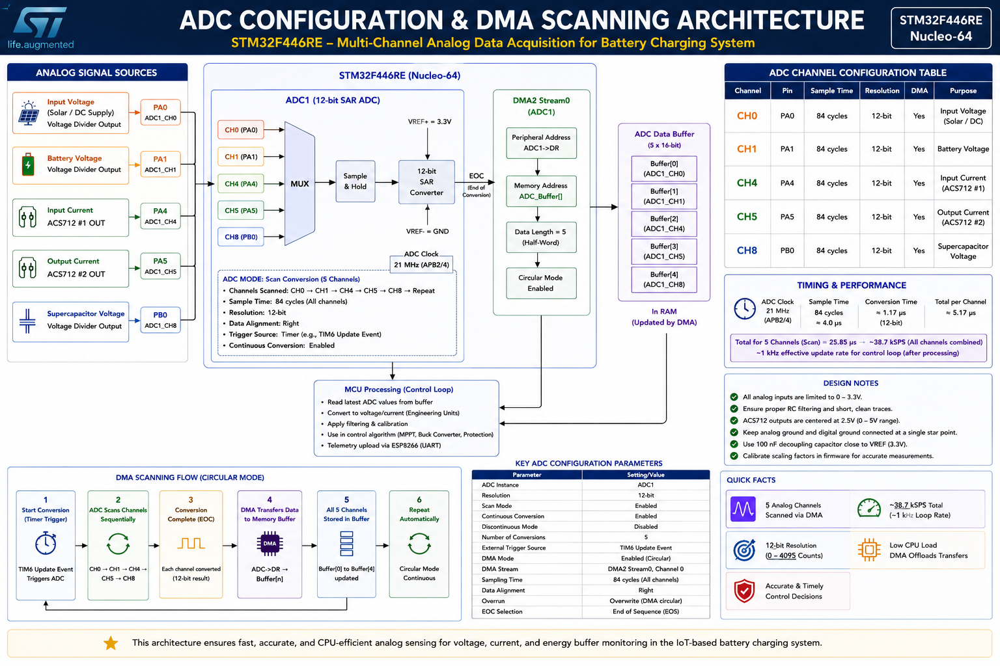
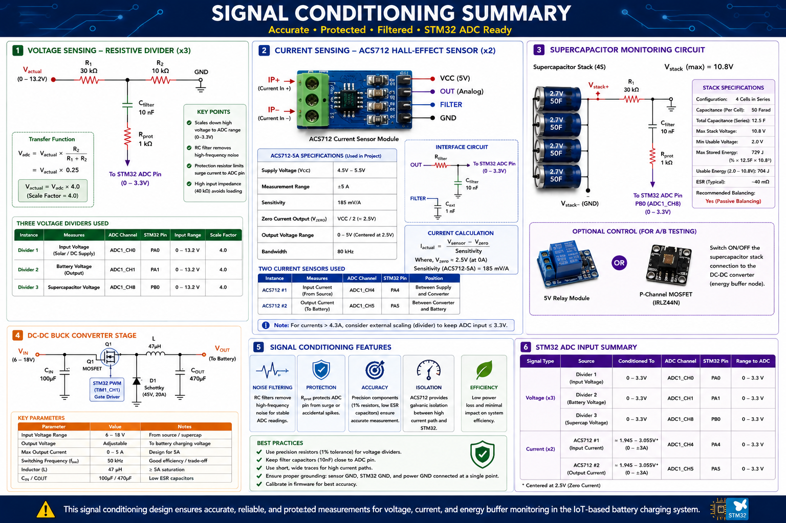

<!---
Project Title: IOT-ENABLED SOLAR-ASSISTED HIGH-EFFICIENCY BATTERY CHARGING USING SUPERCAPACITOR ENERGY BUFFERING
Author: Ajeesh Kumar R | BITS ID: 2024MT12104
Programme: M.Tech in Software Systems - Specialization in IoT
Institution: BITS Pilani - Work Integrated Learning Program (WILP) Division

Academic Purpose Notice:
  This document is developed solely for academic learning, research, experimentation,
  and project evaluation purposes under the M.Tech in Software Systems - Specialization
  in IoT programme at BITS Pilani WILP.

Ownership: All project work is the intellectual work of the above-mentioned author unless otherwise referenced.
Usage Restriction: Unauthorized copying, redistribution, or commercial usage without prior permission is discouraged.
--->

# STM32F446RE Pin Connections



## Pin Mapping Table

| STM32 Pin | Peripheral | Function | Connected To | Notes |
|-----------|-----------|----------|--------------|-------|
| **PA0** | ADC1_CH0 | Analog Input | Voltage Divider (Input) | Solar/DC supply voltage sensing |
| **PA1** | ADC1_CH1 | Analog Input | Voltage Divider (Output) | Battery voltage sensing |
| **PA2** | USART2_TX | UART Transmit | ESP8266 RX (GPIO3) | 115200 baud, 3.3V logic |
| **PA3** | USART2_RX | UART Receive | ESP8266 TX (GPIO1) | 115200 baud, 3.3V logic |
| **PA4** | ADC1_CH4 | Analog Input | ACS712 #1 OUT | Input current measurement |
| **PA5** | ADC1_CH5 | Analog Input | ACS712 #2 OUT | Output current measurement |
| **PA8** | TIM1_CH1 | PWM Output | Gate Driver → MOSFET | 100 kHz switching frequency |
| **PB0** | ADC1_CH8 | Analog Input | Voltage Divider (Supercap) | Supercapacitor voltage |
| **3V3** | Power | 3.3V Output | ADC VREF, logic ref | STM32 internal regulator |
| **5V** | Power | 5V Output | ACS712 VCC (×2) | From USB or external |
| **GND** | Power | Ground | Common ground plane | Star topology |

## STM32 Nucleo Board Diagram





```
                    ┌─────────────────────────────────┐
                    │      STM32F446RE Nucleo-64       │
                    │                                  │
    V_in divider ──►│ PA0  (ADC1_CH0)                  │
   V_bat divider ──►│ PA1  (ADC1_CH1)                  │
     ESP8266 RX  ◄──│ PA2  (USART2_TX)                 │
     ESP8266 TX  ──►│ PA3  (USART2_RX)                 │
   ACS712 #1 OUT ──►│ PA4  (ADC1_CH4)                  │
   ACS712 #2 OUT ──►│ PA5  (ADC1_CH5)                  │
    Gate Driver  ◄──│ PA8  (TIM1_CH1 PWM)              │
  V_cap divider  ──►│ PB0  (ADC1_CH8)                  │
                    │                                  │
                    │ 3V3 ──► VREF / Logic             │
                    │ 5V  ──► Sensor Power             │
                    │ GND ──► Common Ground            │
                    └─────────────────────────────────┘
```

## UART Connection — STM32 to ESP8266



```
    STM32F446RE                          ESP8266 NodeMCU
    ┌──────────┐                         ┌──────────────┐
    │          │                         │              │
    │  PA2 (TX)├────────────────────────►│ RX (GPIO3)   │
    │          │                         │              │
    │  PA3 (RX)│◄────────────────────────┤ TX (GPIO1)   │
    │          │                         │              │
    │  GND     ├─────────────────────────┤ GND          │
    │          │                         │              │
    └──────────┘                         └──────────────┘

    Protocol: UART, 115200 baud, 8N1
    Logic Level: Both 3.3V (no level shifter needed)
    Data Format: JSON-like ASCII frames, newline-terminated
```

## PWM Output — Gate Driver Connection



```
    STM32                Gate Driver           Power MOSFET
    ┌──────┐            ┌──────────┐          ┌──────────┐
    │      │   3.3V     │          │  12V     │          │
    │ PA8  ├───────────►│ IN   OUT ├─────────►│ GATE     │
    │(TIM1)│            │          │          │          │
    │      │            │ VCC  GND │          │ DRAIN ───┤──► To Inductor
    │ GND  ├────────────┤ GND      │          │ SOURCE ──┤──► GND
    └──────┘            └──────────┘          └──────────┘

    PWM Frequency: 100 kHz
    Duty Cycle Range: 5% – 90%
    Soft-start: 1% increment per control cycle
```

## ADC Configuration





| Channel | Pin | Sample Time | Resolution | DMA | Purpose |
|---------|-----|-------------|-----------|-----|---------|
| CH0 | PA0 | 84 cycles | 12-bit | Yes | Input voltage |
| CH1 | PA1 | 84 cycles | 12-bit | Yes | Battery voltage |
| CH4 | PA4 | 84 cycles | 12-bit | Yes | Input current |
| CH5 | PA5 | 84 cycles | 12-bit | Yes | Output current |
| CH8 | PB0 | 84 cycles | 12-bit | Yes | Supercap voltage |

- **ADC Clock:** 21 MHz (APB2/4)
- **Conversion Time:** ~5 µs per channel
- **Scan Mode:** All 5 channels scanned sequentially via DMA
- **Sampling Rate:** ~1 kHz effective (per control loop iteration)
