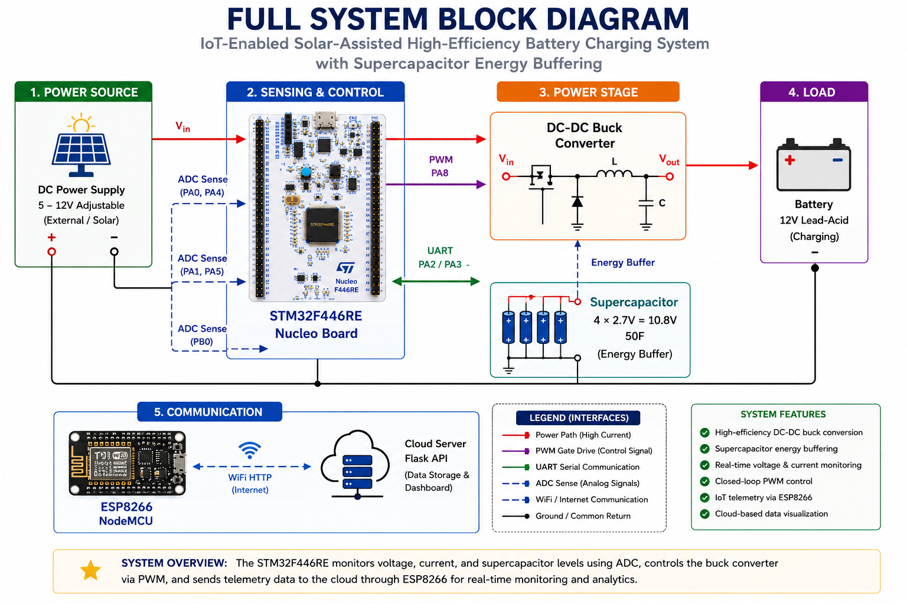
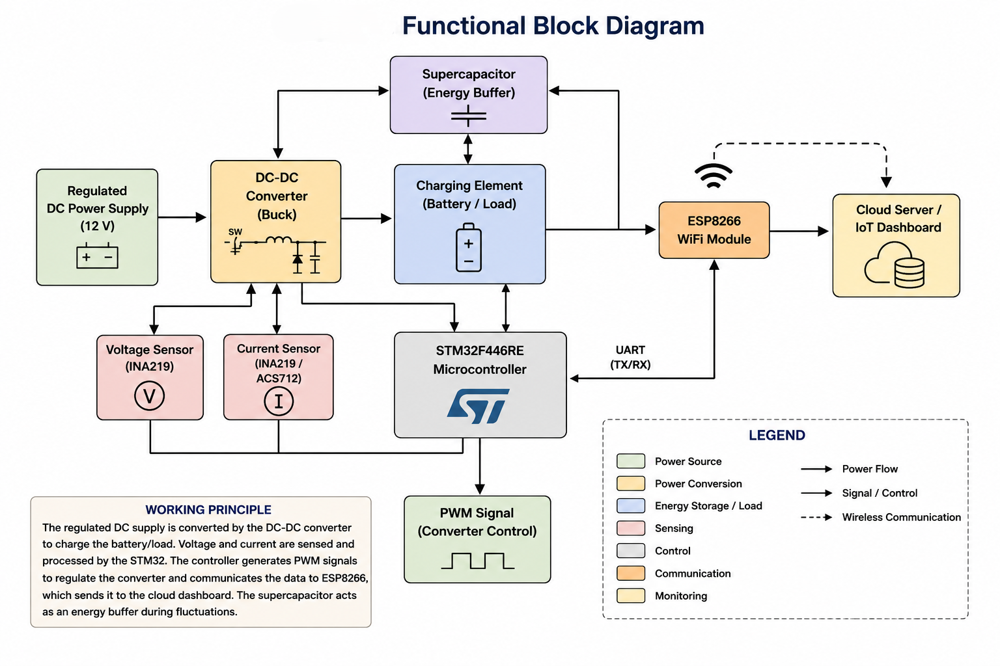
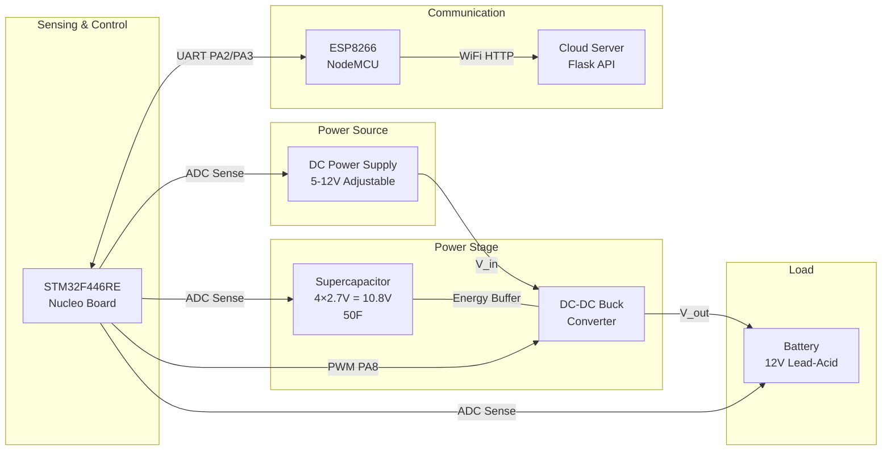
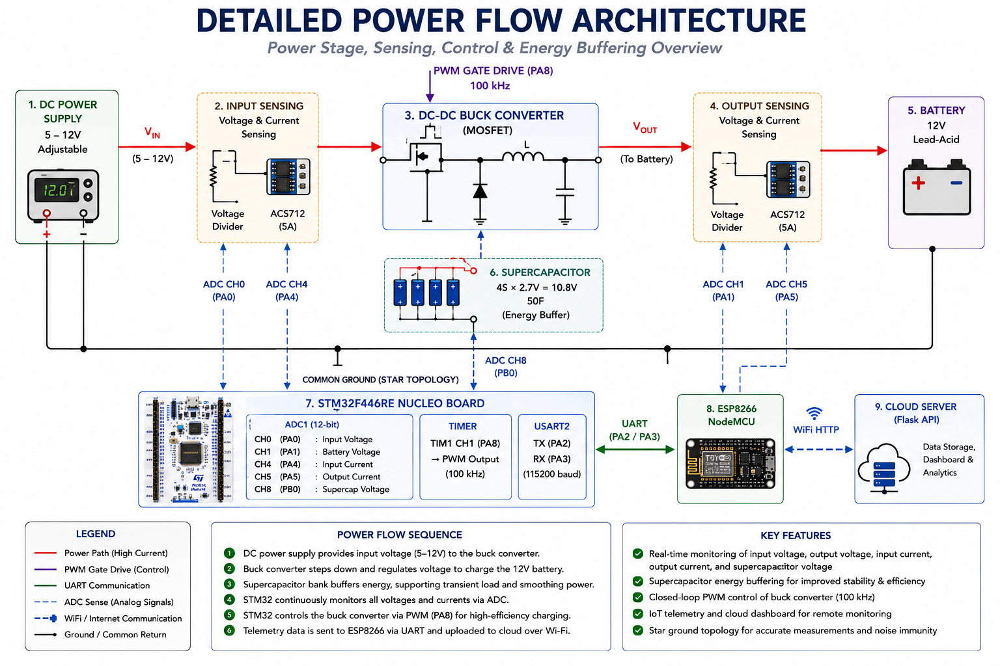
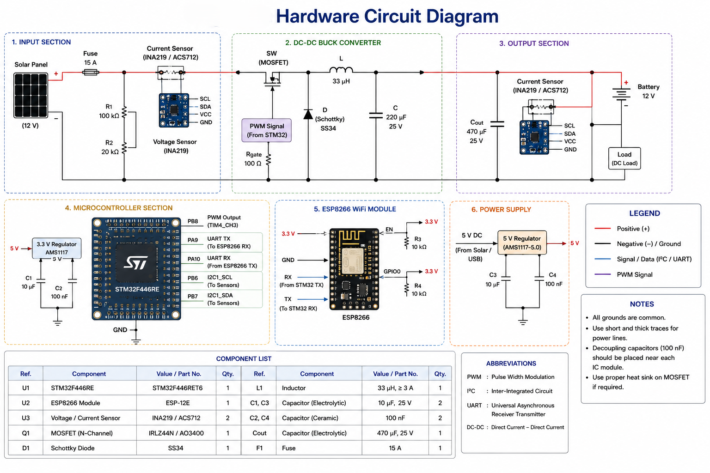
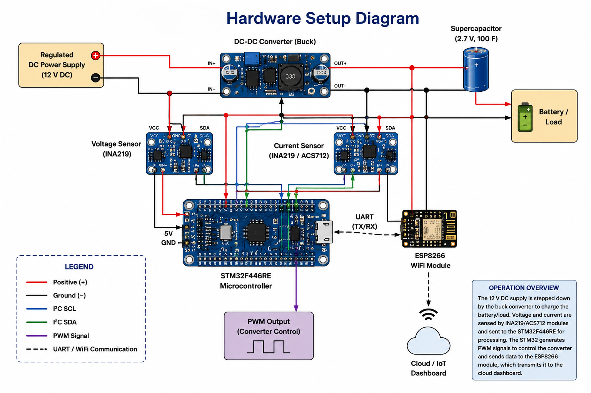
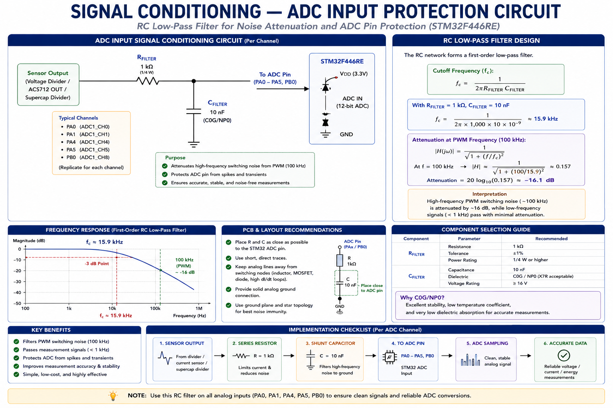
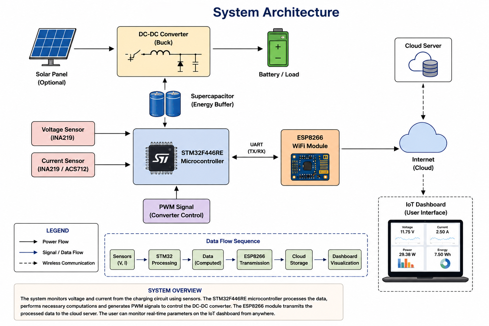
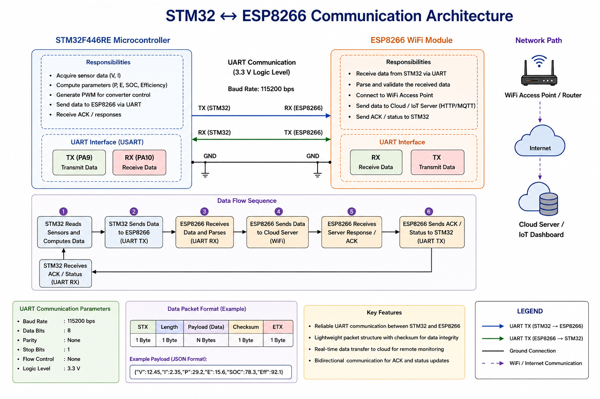
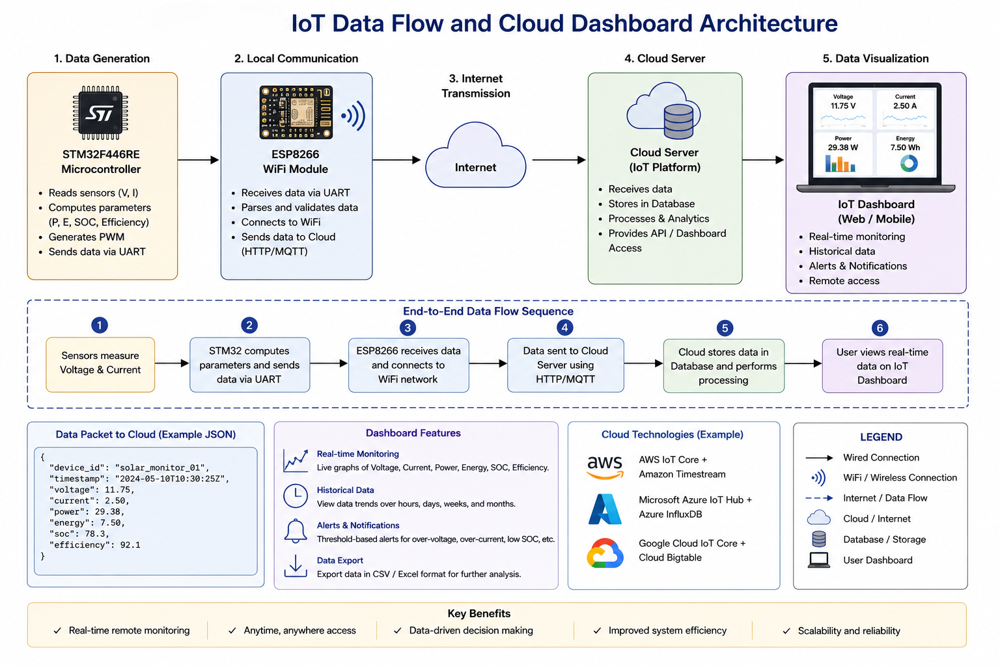

<!---
Project Title: IOT-ENABLED SOLAR-ASSISTED HIGH-EFFICIENCY BATTERY CHARGING USING SUPERCAPACITOR ENERGY BUFFERING
Author: Ajeesh Kumar R | BITS ID: 2024MT12104
Programme: M.Tech in Software Systems - Specialization in IoT
Institution: BITS Pilani - Work Integrated Learning Program (WILP) Division

Academic Purpose Notice:
  This document is developed solely for academic learning, research, experimentation,
  and project evaluation purposes under the M.Tech in Software Systems - Specialization
  in IoT programme at BITS Pilani WILP.

Ownership: All project work is the intellectual work of the above-mentioned author unless otherwise referenced.
Usage Restriction: Unauthorized copying, redistribution, or commercial usage without prior permission is discouraged.
--->

# System Schematic — Full Circuit Diagram

## High-Level System Block Diagram







## Detailed Power Flow



```
                                    PWM Gate Drive (PA8)
                                           │
┌──────────────┐    ┌──────────────┐   ┌───▼───────────┐    ┌───────────────┐
│  DC Power    │    │  Input       │   │   DC-DC Buck  │    │   Battery     │
│  Supply      ├────┤  Voltage &   ├───┤   Converter   ├────┤   12V         │
│  5-12V       │    │  Current     │   │   (MOSFET)    │    │   Lead-Acid   │
│              │    │  Sensing     │   │               │    │               │
└──────────────┘    └──────┬───────┘   └───────┬───────┘    └───────┬───────┘
                           │                   │                    │
                     ADC CH0 (PA0)             │              ADC CH1 (PA1)
                     ADC CH4 (PA4)             │              ADC CH5 (PA5)
                           │                   │                    │
                           ▼                   ▼                    ▼
                    ┌──────────────────────────────────────────────────────┐
                    │              STM32F446RE Nucleo                       │
                    │                                                       │
                    │  ADC1: CH0(PA0), CH1(PA1), CH4(PA4), CH5(PA5),       │
                    │        CH8(PB0)                                       │
                    │  TIM1: CH1(PA8) → PWM output                         │
                    │  USART2: TX(PA2), RX(PA3)                            │
                    └───────────────────────┬──────────────────────────────┘
                                            │
                              ┌──────────────┘
                              │
                              │ ADC CH8 (PB0)
                              │
                    ┌─────────▼──────────┐
                    │  Supercapacitor     │
                    │  4S × 2.7V = 10.8V │
                    │  50F               │
                    │  (Energy Buffer)   │
                    └────────────────────┘
```

## Component Interconnections





```
┌─────────────────────────────────────────────────────────────────────────┐
│                        STM32F446RE NUCLEO-64                              │
├──────────┬──────────────────────────────────────────────────────────────┤
│  Pin     │  Connection                                                   │
├──────────┼──────────────────────────────────────────────────────────────┤
│  PA0     │  → Voltage Divider (Input)  → R1=30kΩ → V_in                │
│  PA1     │  → Voltage Divider (Output) → R1=30kΩ → V_battery           │
│  PA4     │  → ACS712-5A (Input Current Sensor, OUT pin)                 │
│  PA5     │  → ACS712-5A (Output Current Sensor, OUT pin)                │
│  PB0     │  → Voltage Divider (Supercap) → R1=30kΩ → V_supercap        │
│  PA8     │  → Gate Driver IC → MOSFET Gate (DC-DC Buck Converter)       │
│  PA2     │  → ESP8266 RX (UART TX, 115200 baud)                        │
│  PA3     │  ← ESP8266 TX (UART RX, 115200 baud)                        │
│  3.3V    │  → V_REF for ADC, logic level reference                     │
│  GND     │  → Common ground (star topology)                             │
│  5V      │  → ACS712 VCC (both sensors)                                 │
└──────────┴──────────────────────────────────────────────────────────────┘
```

## Signal Conditioning — ADC Input Protection



```
                    R_filter = 1kΩ
    Sensor Out ────/\/\/\/──────┬──────── ADC Pin (PA0-PA5, PB0)
                                │
                           C_filter = 10nF
                                │
                               GND

## System Architecture Overview



## Communication Architecture




